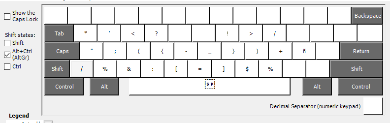

# Mi configuración personal

Mi configuración de windows y de wsl:
Para poder integrar la configuración rapidamente hay que correr los siguientes comandos:

```bash
git clone https://github.com/yonext24/dotfiles ~/.dotfiles

# Crear symlinks

mkdir ~/.config

ln -s ~/.dotfiles/nvim ~/.config/nvim

ln -s ~/.dotfiles/zsh/.zshrc ~/.zshrc
ln -s ~/.dotfiles/zsh/.oh-my-zsh ~/.oh-my-zsh
ln -s ~/.dotfiles/zsh/.p10k.zsh ~/.p10k.zsh

ln -s ~/.dotfiles/utils/cmnt ~/dev/utils/cmnt

ln -s ~/.dotfiles/tmux/.tmux.conf ~/.tmux.conf
ln -s ~/.dotfiles/tmux ~/.config/tmux/
```

Las utilidades que hay en /utils estan pensadas para estar dentro del PATH,
aunque algunos comandos estan pensados para estar en %HOMEPATH%/dev/utils,
así que si se cambian de ese lugar hay que modificarlos.

Esta configuración también contiene el layout de teclado que utilizo.
Esta se tiene que buildear con [Keyboard Layout editor](https://www.microsoft.com/en-us/download/details.aspx?id=102134)


(Tengo mapeado el CapsLock para ser Alt)
